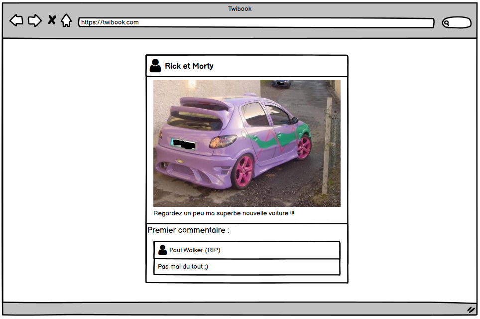
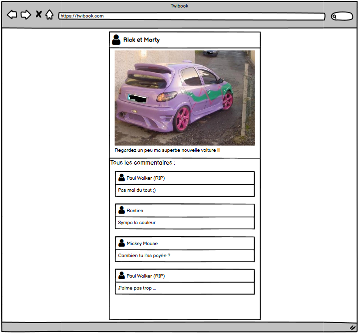
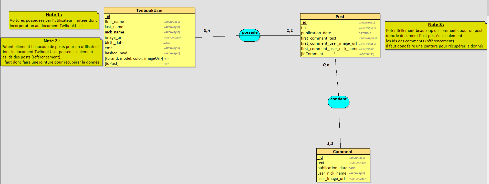
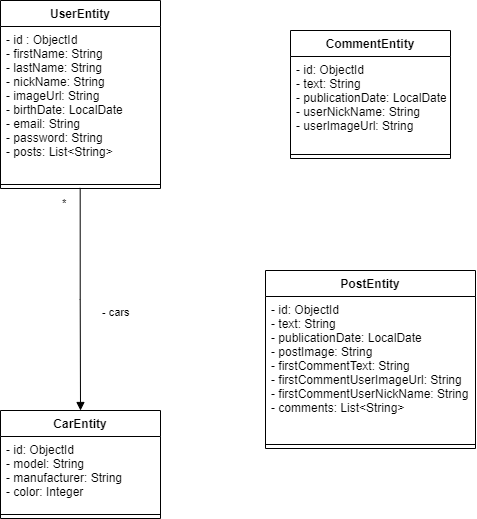

# Twibook en quelques mots
Twibook est un réseau social pour les fans de grosses cylindrées. Nous avons pour ambition de réunir les amateurs de beaux bolides à un même endroit afin qu'ils puissent échanger au sujet de leur passion avec des posts pouvant contenir du texte et une photo. Le réseau social est inspiré de Facebook et de Twitter. Ainsi, les utilisateurs pourront ajouter des posts à leur timeline et les autres utilisateurs auront la possibilité de les commenter. 

## Contexte de création du site web

### Contraintes techniques imposées

- Une limite de 4 photos par post a été fixée afin d'éviter d'avoir des photos illisibles
- Lorsqu'un utilisateur visionne la timeline de Twibook, les posts sont "réduits". Cela signifie que seul le post est visible ainsi que le premier commentaire publié sous le post
- Lorsqu'un utilisateur clique sur un post, celui-ci se "déplie". Cela signifie que l'ensemble des commentaires seront alors visibles en plus du contenu du post.
- Pour des questions de quota serveur, aucune image n'est enregistré dans le stockage du site, celles-ci sont uploadés directement depuis le web grâce à leur URL

Voici un sketch montrant ce que l'on appelle un post "réduit" : 

Voici un sketch montrant ce que l'on appelle un post "déplié" : 

### Techologies utilisées

Dans le cadre du cours de "Client-Serveur", sera la partie back sera développée ainsi qu'une application console pour valider le fonctionnement : 
- Le back sera développé en JAVA - Spring Boot
- La couche de persistance des données sera gérée par une base de données MongoDB
- Le front sera réalisé en Ionic Angular TS

## Partie client/serveur

### Architecture globale No SQL

Après avoir réfléchi aux différentes contraintes techniques que nous nous imposons pour la réalisation du projet, nous avons retranscrit cela sous la forme d'un diagramme UML. Les contraintes techniques sont explicitées grâce aux cardinalités du diagramme :

Nous avons décidé de rajouter de l'incoporation dans les objets suivants : 
- Comment : Permet d'afficher le pseudo et l'utilisateur et son avatar sans avoir à faire une sous requête pour récupérer ces attributs
- Post : Permet d'afficher le premier commentaire du post sans voir à faire une sous requête pour le récupérer

Nous avons décidé d'utiliser le référencement pour séparer les posts des commentaires ainsi que pour séparer les users des posts. Cela nécessitera donc de travailler avec les jointures pour requêter les données mais cela évitera d'avoir des résultats de requêtes trop importants (un post peut potentiellement avoir un grand nombre de commentaires qui lui sont associé).

Pour la relation entre un utilisateur et ses voitures, nous auront une relation OneToFew car un utilisateur ne possédera jamais un très grand nombre de voitures. Nous avons donc choisi d'utiliser l'incorporation des voitures dans le document "user".

### Patron NoSQL implémenté

Nous avons également implémenté le patron NoSQL "Schema Versioning". Ce patron permet d'ajouter un numéro de version aux différents documents de la base. Ce numéro de version permettra de modifier les documents qui seront dans un numéro de version inférieur de la version courante dans le but qu'ils aient la même structure que les nouveaux documents insérés. Le patron facilite donc grandement les migrations en diminuant le temps d'exécution de celle-ci.

L'intégralité de nos documents ont donc un champ "schema_version" de type string qui contient la version actuelle du document.

### Diagramme de classes des entités JAVA

On retrouve les différents référencements (id des posts dans user et id des comments dans post)
On retrouve également l'incorporation des voitures dans la classe utilisateur

### Utilisation des indexes

Les champs email et pseudo ont été indexés pour les utilisateurs car :
- Lors de la connexion, c'est le pseudo de l'utilisateur qui est utilisé pour récupérer son mot de passe hashé
- Lors de l'inscription, il faur vérifier que l'email de l'utilisateur n'est pas déjà utilisée

##Partie multiplateformes

### Packages utilisés

Pour la réalisation du projet, nous avons utilisé différents packages. Voici une liste non-exaustives des principaux packages utilisés : 
- @capacitor/camera : Permet de gérer la prise de photos mais aussi de récupérer une photo existante dans les fichiers de l'appareil
- @angular/router : Permet de gérer l'accès aux pages en fonction de si l'utilisateur est connecté ou non
- bcrypt.js : Permet de hasher le mot de passe de l'utilisateur et de le comparer pour la connexion de celui-ci

### Arborescence du projet

L'arborescence du projet ce décompose en plusieurs dossiers contenant les différentes classes de l'application Angular : 
- Auth : Contient le service permettant d'accorder ou non l'accès aux différentes pages
- Model : Contient les classes métier de l'application 
- Services : Contient les différents services qui seront injectés dans les constructeurs des différentes pages (controlleur, stub, apiclient, camera ...)
- Views: Contient les différentes pages de l'application
- Views/Components : Contient les composants graphiques utilisés par les views

###UI/UX

Nous avons voulu donner un style "tuning" à notre réseau social puisqu'il se veut centré les amateurs de grosses cylindrées et de tuning. Voici quelques captures d'écran de l'application : 

###Device API

Nous utilisons l'appareil photo du téléphone ainsi que son stockage pour pouvoir publier un post. L'utilisateur peut prendre une photo et l'intégrer à son post. La photo est par la suite convertie en base64 pour être enregistrée dans la base de données.
Pour cela, nous avons créé un service qui utilise le package "@capacitor/camera".

###Api HTTP

Notre application conatate l'API REST Java Spring Boot pour pouvoir effctuer les opérations CRUD sur la base de données. La liaison entre les deux est garantie par le service "Api-Client". Ce service crée les requêtes sur les différents endpoints de l'API et retourne des "Observable" qui pourront par la suite être consommés par le front.

L'opération DELETE est bien implémentée mais non-utilisée par le front car nous n'en avons pas l'utilité pour le moment.

Nous avons également le moyen de changer la persistence pour un stub grâce à l'injection de dépendances pour réaliser nos tests sur le front.

###Data access/storage

Utilisation du Web-basedstorage pour sauvegarder l'utilisateur connecté. Un nouvel item est donc créé lors de la connexion dans le "app-controlleur" et est détruit lors de la déconnexion dans le "app-controlleur". Le srvice "auth.guard" consomme cet item pour savoir si l'utilisateur est connecté ou non.

